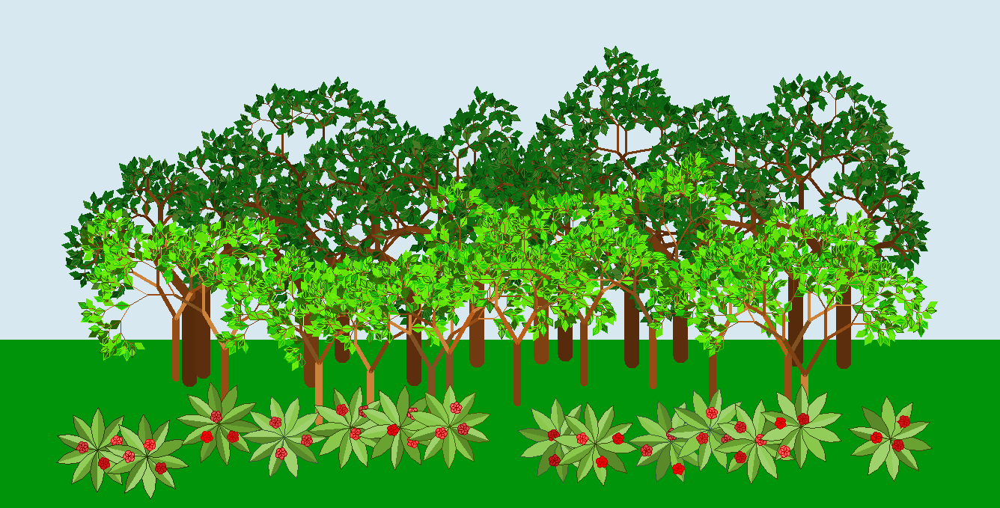

<h1>Triangle Fractal In Python</h1>

 
<h3 style="font-size: 20; ">
STEP 1:
 
IMPORTING LIBRARY
</h3>
<pre style="font-size: 15; ">
import turtle
</pre>
<h3 style="font-size: 20; ">
STEP 2:
 
DEFINING TRIANGLE FUNCTION
</h3>
<pre style="font-size: 15; ">
def triangle(s):
    turtle.pencolor("#a5cbe2")
    turtle.pensize(2)
    turtle.forward(s)
    turtle.left(120)
    turtle.forward(s)
    turtle.left(120)
    turtle.forward(s)
    turtle.left(120)
    
</pre>
<h3 style="font-size: 20; ">
STEP 3:
 
DEFINING FRACTAL FUNCTION
</h3>
<pre style="font-size: 15; ">
def fractal(n, s):
    if n == 0:
        triangle(s)
    else:
        turtle.fillcolor("#74a7d2")
        turtle.begin_fill()
        fractal(n-1, s/2)
        turtle.end_fill()
        turtle.forward(s/2)
        turtle.fillcolor("#3b7fb9")
        turtle.begin_fill()
        fractal(n-1, s/2)
        turtle.end_fill()
        turtle.left(120)
        turtle.forward(s/2)
        turtle.right(120)
        turtle.fillcolor("#234c6f")
        turtle.begin_fill()
        fractal(n-1, s/2)
        turtle.end_fill()
        turtle.right(120)
        turtle.forward(s/2)
        turtle.left(120)
</pre>
<h3 style="font-size: 20; ">
FINAL STEP:
 
RUNNING THE CODE
</h3>
<pre style="font-size: 15; ">
turtle.tracer(0)
fractal(5, 400)
turtle.update()
turtle.mainloop()

</pre>
<h3 style="font-size: 20; ">
FINAL RESULT
</h3>

<h1 style="font-size: 25; "> Tree Fractal </h1>
<h3 style="font-size: 20; ">
STEP 1:
 
IMPORTING LIBRARY
</h3>
<pre style="font-size: 15; ">
import turtle
</pre>
<h3 style="font-size: 20; ">
STEP 2:
 
DEFINING LEAF FUNCTION
</h3>
<pre style="font-size: 15; ">
def leaf():
    turtle.pencolor("#0f6401")
    turtle.fillcolor("#1fc803")
    turtle.begin_fill()
    turtle.left(30)
    turtle.forward(9)
    turtle.right(60)
    turtle.forward(9)
    turtle.right(120)
    turtle.forward(9)
    turtle.right(60)
    turtle.forward(9)
    turtle.right(150)
    turtle.forward(9 * (3 ** 0.5))
    turtle.backward(9 * (3 ** 0.5))
    turtle.end_fill()
</pre>
<h3 style="font-size: 20; ">
STEP 3:
 
DEFINING TREE FUNCTION
</h3>
<pre style="font-size: 15; ">
def tree(d, r, w):
    if d < 7 or r < 7:
        return
    turtle.pensize(w)
    turtle.forward(d)
    turtle.left(r)
    tree(d * 0.7, r, w*0.6)
    if d > 7 and d < 9:
        leaf()
    turtle.right(2 * r)
    tree(d * 0.7, r, w*0.6)
    turtle.left(r)
    turtle.backward(d)
    turtle.pencolor("#ab6b37")
        
</pre>
<h3 style="font-size: 20; " style="text-align: left;font-family: tahoma">
FINAL STEP:
 
RUNNING THE CODE
</h3>
<pre style="font-size: 15; ">
turtle.pencolor("#ab6b37")
turtle.speed(0)
turtle.left(90)
tree(100, 30, 10)
turtle.mainloop()
</pre>
<h3 style="font-size: 20; ">
FINAL RESULT
</h3>

<h1 style="font-size: 25; "> Jungle </h1>
 
- for making a jungle in python first of all we need two functions: one for trees and another one for
  bushes.then we use random library to print our trees and bushes in random places.we can use
 variables to organizie them so we'll get a better result in the end
 
- here is an example of using variables:

<pre style="font-size: 15; ">
for n in range(12):
    x1 = -480 + (n*80)
    x2 = -480 + ((1+n)*80)
    turtle.penup()
    turtle.setpos(random.randint(x1, x2), random.randint(-170, -120))
    turtle.pendown()
    tree(110, 40, 20, 2)
</pre>
