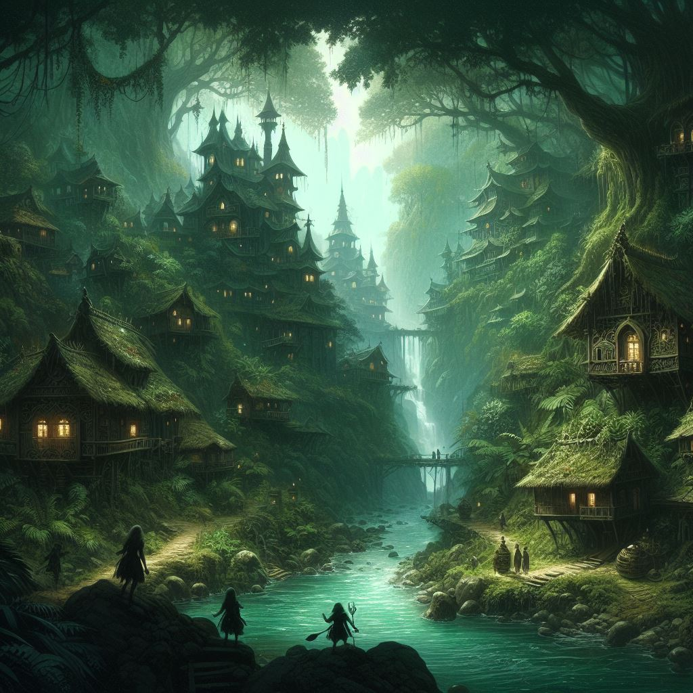
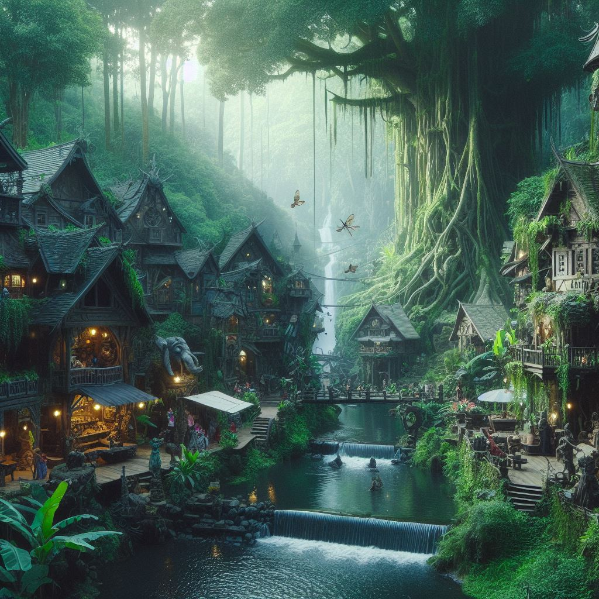
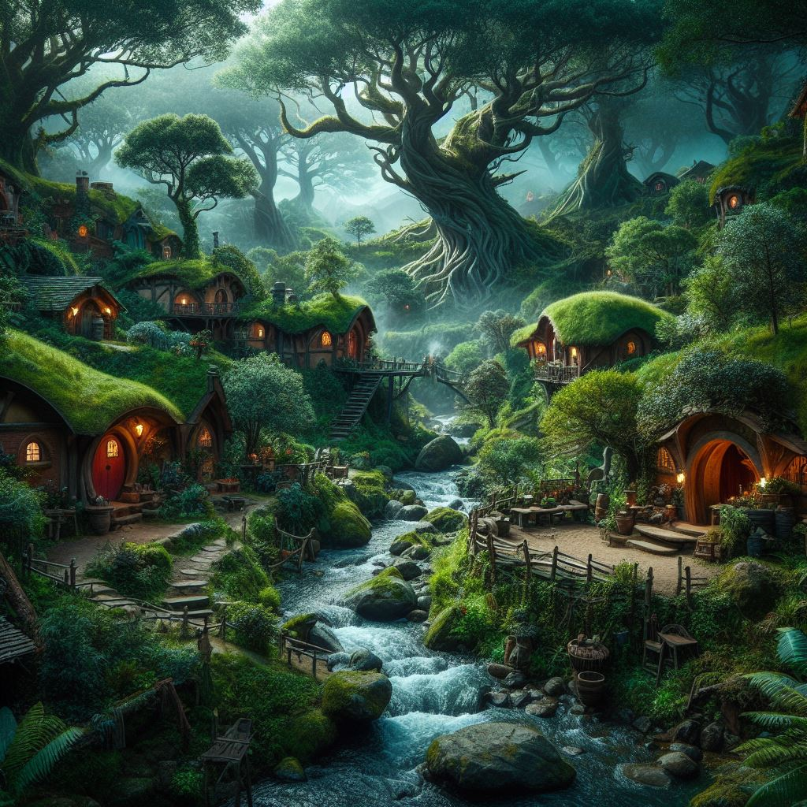
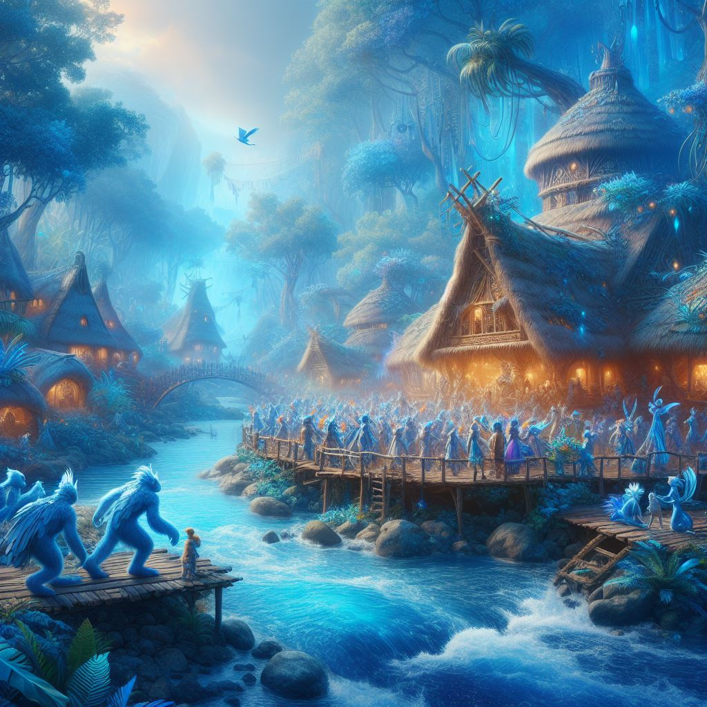

## creating a picture by using bing AI
<h3 style="font-size: 20; ">
first of all i gave this informations:
</h3>
<pre style="font-size: 13; ">
fantasy village in jungle, fantasy houses, dark green theme, river, short people
</pre>
<h3 style="font-size: 20; ">
and here is one of the results:
</h3>

<h3 style="font-size: 20; ">
then i gavr this:
</h3>
<pre style="font-size: 13; ">
fantasy village in jungle, fantasy houses, dark green theme, river,hobbits, waterfall, shopping stores, tall old trees
</pre>

<h3 style="font-size: 20; ">
then this:
</h3>
<pre style="font-size: 13; ">
fantasy village in jungle, fantasy houses, dark green theme, river, hobbits, waterfall, shopping stores, tall old trees, lord of rings theme
</pre>

<h3 style="font-size: 20; ">
and in the end:
</h3>
<pre style="font-size: 13; ">
fantasy village, river, blue, dreamy, fantasy people, party, dancing, blue jungle, water
</pre>

---
**Test**: This is atest
